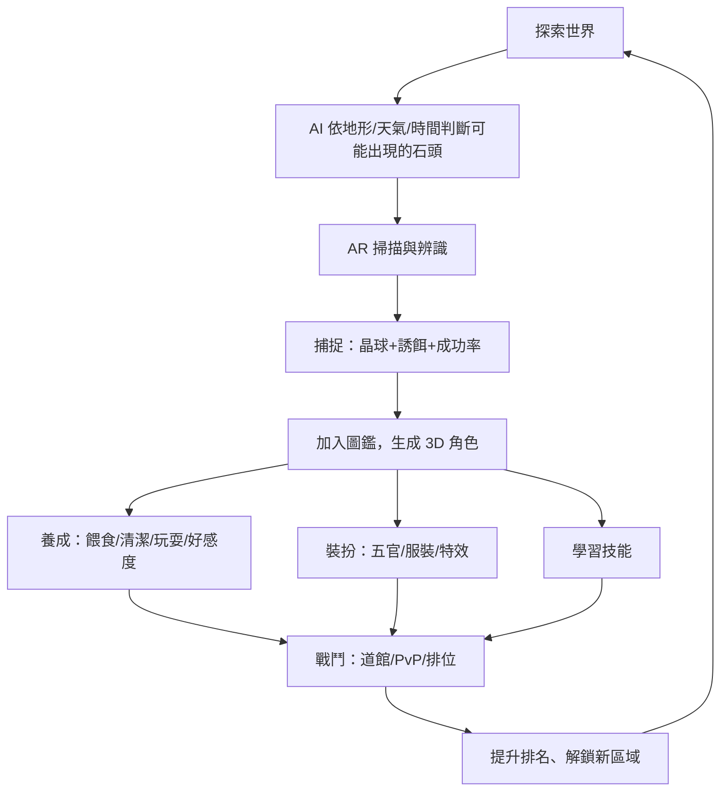

# 石頭大師 Stone Master
## 遊戲設計文件 (Game Design Document)

| 項目 | 內容 |
|---|---|
| 版本 | v0.1 draft |
| 日期 | 2026-07-22 |
| 平台 | iOS / Android |
| 類型 | AR 探索 × AI 圖鑑 × 收集養成 × 策略戰鬥 |
| 商業模式 | F2P + 內購 + 季節活動（詳見第 18 章） |
| 狀態 | 設計草案，待原型驗證 |

---

## 目錄

1. [一句話願景](#1-一句話願景)
2. [核心支柱](#2-核心支柱)
3. [核心遊戲循環](#3-核心遊戲循環)
4. [AR 真實石頭掃描系統](#4-ar-真實石頭掃描系統)
5. [AI 石頭百科系統](#5-ai-石頭百科系統)
6. [AI 原創石頭生成系統](#6-ai-原創石頭生成系統)
7. [石頭圖鑑系統](#7-石頭圖鑑系統)
8. [角色自由創造（五官編輯）](#8-角色自由創造五官編輯)
9. [服裝裝扮系統](#9-服裝裝扮系統)
10. [石頭養成系統](#10-石頭養成系統)
11. [探索與召喚系統](#11-探索與召喚系統)
12. [捕捉系統](#12-捕捉系統)
13. [戰鬥系統](#13-戰鬥系統)
14. [技能系統](#14-技能系統)
15. [排名與競技系統](#15-排名與競技系統)
16. [道館系統](#16-道館系統)
17. [多人社交系統](#17-多人社交系統)
18. [商業模式與虛擬經濟](#18-商業模式與虛擬經濟)
19. [AI 個人化助手](#19-ai-個人化助手)
20. [新手引導與留存設計](#20-新手引導與留存設計)
21. [環境倫理與合規原則](#21-環境倫理與合規原則)

---

## 1. 一句話願景

> 帶著手機走進現實世界，用 AI 讀懂腳邊的每一顆石頭，把它變成獨一無二的夥伴——養成牠、打扮牠、帶牠戰鬥，直到你成為世界公認的**石頭大師**。

**目標玩家**：對集換式怪物養成遊戲（如寶可夢 GO、動物森友會、我的水族箱）有好感、同時對地質/礦物/戶外探索有好奇心的 8～45 歲玩家，女性向養成裝扮玩家與硬核收集/戰鬥玩家並重。

## 2. 核心支柱

這五條支柱是所有系統設計時的取捨依據：

1. **現實即內容（AR-native）**：遊戲的「地圖」就是玩家真實所在的世界，內容供給不靠美術產能，靠玩家所在的地理與地質多樣性。
2. **每顆石頭獨一無二（AI-personalized）**：兩位玩家不會養出完全相同的石頭，因為輸入（真實石頭的照片特徵）本身就不同。
3. **只掃描、不採集（Leave No Trace）**：玩家「捕捉」的是石頭的數位分身，石頭本體留在原地——這同時解決環保/法規爭議，也讓同一顆石頭可以被無限次重新造訪、被多名玩家各自捕捉出屬於自己的版本。
4. **看得懂、學得到（寓教於樂）**：AI 百科的地質知識必須有依據、可信任，讓遊戲同時是一本會互動的地質圖鑑。
5. **長線養成與社交**：養成、裝扮、戰鬥、排名、公會構成可以玩上數年的迴圈，而非一次性打卡。

## 3. 核心遊戲循環

**核心迴圈時長設計**：
- **微迴圈（1～3 分鐘）**：一次掃描 + 捕捉，適合通勤零碎時間。
- **中迴圈（10～15 分鐘）**：養成互動 + 一場道館戰，對應每日登入。
- **長迴圈（週／季）**：圖鑑完成度、排位賽季、公會活動。

## 4. AR 真實石頭掃描系統

### 4.1 目的
把「相機對準一顆石頭」變成遊戲最核心、最高頻的互動，同時是所有下游系統（AI 辨識、捕捉、圖鑑）的資料入口。

### 4.2 玩家流程
1. 開啟 AR 掃描器 → 相機取景框引導玩家繞石頭拍攝 3～5 個角度（俯視、側面 ×2、細節特寫）。
2. 系統即時提示光線是否足夠、是否對焦、石頭是否佔滿框內比例。
3. 拍攝完成 → 播放掃描動畫（AR 疊加掃描光紋、資訊浮窗）。
4. 顯示辨識結果：石頭分類、初步屬性、稀有度預覽。
5. 若為玩家「第一次」見到此石頭 → 進入捕捉流程（第 12 章）。
6. 若為「重複掃描」自己已捕捉過的石頭 → 直接開啟該角色檔案，讀取既有養成/裝扮/戰鬥紀錄。

### 4.3 「同一顆石頭」辨識機制
- 每次掃描產生一組**視覺指紋**（顏色分佈、紋理特徵、形狀輪廓的向量嵌入 + 感知雜湊）。
- 新掃描結果先與**該玩家自己的圖鑑**做相似度比對（非全球比對，保護效能與隱私）；相似度超過門檻視為同一顆石頭。
- 判定為同一顆時：保留原有角色 ID、等級、好感度、裝扮、技能、戰績；僅刷新「最後造訪時間」與可能的心情加成。

### 4.4 AR 功能
| 功能 | 說明 |
|---|---|
| AR 拍照 | 石頭角色疊加於真實場景合影，可加相框/特效分享 |
| AR 錄影 | 錄製石頭角色在現實場景中的互動短片 |
| AR 互動 | 用手指戳、餵食、丟球等手勢與 AR 中的角色互動 |
| AR 展示 | 把已養成的角色召喚到眼前任意場景把玩、拍照 |

### 4.5 技術需求標籤
`[前端-AR]` `[AI-視覺辨識]` `[後端-指紋比對]`（詳見技術架構文件）

---

## 5. AI 石頭百科系統

### 5.1 資料架構
建立一個**地質知識庫**（岩石三大類：火成岩／沉積岩／變質岩；礦物：水晶／石英／寶石／金屬礦物），每個條目包含：

中文名稱、英文名稱、學名、圖片、分類、顏色、紋理、硬度（莫氏硬度）、密度、光澤、化學成分、形成方式、地質年代、世界產地、台灣產地、收藏價值、用途、趣味知識。

### 5.2 互動方式
玩家可用自然語言詢問 AI 百科助手：
- 「這是什麼石頭？」→ 結合掃描結果直接回答，附信心分數與相似候選。
- 「如何形成？」「哪裡可以找到？」「如何收藏？」「有什麼特色？」→ 從知識庫檢索並生成口語化說明。

### 5.3 內容可信度原則
AI 回答**必須基於知識庫檢索（RAG），禁止自由生成地質事實**，每則回答附上可展開的資料來源摘要，避免對兒童/學生玩家造成錯誤地質教育。知識庫由地質內容顧問審核建置與定期更新。

---

## 6. AI 原創石頭生成系統

### 6.1 定位
除了「現實石頭」之外，開放 AI 生成**原創幻想石頭種族**，用於活動獎勵、稀有掉落、周年慶等，豐富圖鑑深度且不受限於現實石頭種類數量。

### 6.2 生成內容
名稱、外觀、顏色、花紋、稀有度、屬性、性格、技能、故事、棲息地、成長方向。

### 6.3 生成規則
- **數值與稀有度**：由伺服器端規則引擎依機率表決定，確保戰鬥平衡與經濟稀缺性可控（非 AI 自由決定數值）。
- **外觀與故事**：由生成模型產出美術參數（套用第 4.3 節的參數化模型系統）與故事文本，人工內容團隊做週期性審核與挑選上架。
- 每隻原創石頭擁有唯一 ID、唯一外觀組合、唯一故事文本，與現實石頭共用同一套圖鑑/養成/戰鬥系統。

---

## 7. 石頭圖鑑系統

### 7.1 圖鑑首頁
顯示已收集石頭的 3D 模型網格，支援 360 度旋轉檢視、AR 現場檢視、收藏數量、完成百分比（依分類分別統計）。

### 7.2 石頭資料頁結構

| 分類 | 欄位 |
|---|---|
| 基本資料 | 名稱、編號、稀有度、屬性、分類、發現日期、發現地點 |
| 科學資料 | 岩石類型、礦物組成、硬度、密度、光澤、形成原因、產地 |
| 養成資料 | 等級、經驗、好感度、性格、成長時間、成長日記 |
| 戰鬥資料 | HP、攻擊、防禦、速度、能量、已學技能 |
| 裝扮資料 | 五官、衣服、配件、特效 |

### 7.3 分類檢視
依岩石種類、礦物種類、屬性、地區、稀有度、發現時間等多重篩選維度瀏覽圖鑑，並提供「本地區尚未發現」的提示以引導探索。

---

## 8. 角色自由創造（五官編輯與命名）

### 8.1 五官編輯

| 部位 | 選項範例 |
|---|---|
| 眼睛 | 圓眼、星星眼、愛心眼、火焰眼、雷電眼、機械眼、動漫眼、搞笑眼 |
| 嘴巴 | 微笑、大笑、嘟嘴、貓嘴、牙齒嘴、小丑嘴 |
| 其他 | 鼻子、耳朵、腮紅、表情、貼紙 |

每個元件可調整：大小、位置、顏色、旋轉、透明度。編輯結果即時預覽於 3D 模型與 AR 檢視。

### 8.2 石頭命名

捕捉成功的當下，玩家可以幫這顆石頭取一個專屬暱稱（非必填，留空則用系統生成的預設稱呼，如「河邊小圓」）。

- 暱稱顯示於圖鑑列表、養成互動畫面、戰鬥介面、好友來訪時看到的展示牌——凡是會出現這顆石頭的地方，優先顯示暱稱而非物種學名
- 可隨時到石頭資料頁重新命名，不限一次
- 長度限制（建議 1～10 字）與基本不雅字詞過濾，比照第 17 章多人社交系統的內容審核機制

此設計與第 7 章圖鑑系統的差異：圖鑑「物種資料」（如「花崗岩」）是每隻同物種石頭共用的科學資訊，暱稱則是玩家對「這一隻個體」的專屬稱呼，兩者並存、互不覆蓋。

---

## 9. 服裝裝扮系統

| 分類 | 範例 |
|---|---|
| 帽子 | 皇冠、巫師帽、海盜帽、棒球帽、聖誕帽 |
| 衣服 | T 恤、西裝、和服、忍者服、魔法袍、太空服、騎士盔甲 |
| 配件 | 眼鏡、披風、翅膀、尾巴、背包、項鍊 |
| 特效 | 火焰、冰霜、雷電、星星、彩虹、愛心 |

裝扮為主要**內購與活動獎勵載體**（見第 18 章），不影響戰鬥數值，維持付費與競技公平性分離（cosmetic-only monetization）。

---

## 10. 石頭養成系統

**數值構面**：等級、經驗值、好感度、心情。
**互動行為**：餵食、清潔、睡眠、玩耍。
**表現產出**：石頭會依累積互動表達情緒、發展出個性傾向（如親人/怕生/活潑），系統記住玩家並由 AI 生成專屬的成長故事日記，寫入圖鑑「養成資料」的成長日記欄位。

**進化**：石頭在達成等級/好感度雙門檻後可進化，進化改變外觀（保留玩家自訂裝扮的相容映射）與數值成長曲線，不重置已投入的養成進度。

---

## 11. 探索與召喚系統

AI 依下列訊號分析當前位置可能出現的石頭類型：玩家位置、地形、天氣、時間、地質環境資料。

| 地形 | 傾向出現 |
|---|---|
| 山區 | 水晶、礦石 |
| 河流 | 河石、化石 |
| 海邊 | 海洋石 |
| 火山地質區 | 黑曜石 |

**探索工具**：地質羅盤（指引附近熱點方向）、石頭雷達（顯示掃描範圍內的訊號強度）、AI 掃描器、AR 尋寶（限時/限地活動）。

---

## 12. 捕捉系統

**捕捉工具**：共鳴晶球、高級晶球、傳說晶球、能量網、地質掃描器。
**誘餌**：礦物餅乾、蜂蜜、水晶粉、花蜜。

捕捉成功率由「工具強度 × 誘餌加成 × 稀有度係數 × 親密度（重複造訪同一顆石頭會提高後續互動成功率）」計算，並保留特殊事件（如「稀有天候石頭」「限時發光石」）製造驚喜感與分享動機。

---

## 13. 戰鬥系統

**屬性（十系）**：火、水、雷、冰、森林、大地、水晶、光、暗、星辰——彼此構成克制循環，供戰鬥與圖鑑分類使用。

**戰鬥能力值**：HP、攻擊、防禦、速度、能量。

戰鬥採**伺服器權威回合制**（詳見技術架構文件），確保 PvP 排位結果不可由端側竄改。

---

## 14. 技能系統

### 14.1 攻擊技能

技能對應第 13 章「十系屬性」之一，威力與能量消耗依技能強度分級（能量消耗自第 13 章「能量」戰鬥能力值扣除）。

| 技能 | 屬性 | 威力 | 能量消耗 | 命中率 | 效果 |
|---|---|---|---|---|---|
| 滾石衝鋒 | 大地 | 40 | 15 | 100% | 基礎物理攻擊，無附加效果，能量消耗低適合開局使用 |
| 熔岩爆發 | 火 | 65 | 30 | 95% | 範圍傷害，25% 機率造成「灼燒」（持續 3 回合，每回合扣除目標最大 HP 5%） |
| 雷霆攻擊 | 雷 | 60 | 25 | 90% | 20% 機率使目標「麻痺」，下回合有 30% 機率無法行動 |
| 冰晶飛刃 | 冰 | 55 | 25 | 95% | 15% 機率使目標速度下降 1 階 |
| 水晶爆裂 | 水晶 | 70 | 35 | 90% | 高威力單體傷害 |
| 星辰墜落 | 星辰 | 80 | 45 | 85% | 全技能中最高威力，命中後使自身下回合速度下降 1 階 |

### 14.2 防禦技能

| 技能 | 屬性 | 效果 | 能量消耗 | 持續 |
|---|---|---|---|---|
| 岩石護盾 | 大地 | 本回合受到傷害減少 50% | 20 | 1 回合 |
| 水晶結界 | 水晶 | 全隊受到傷害減少 25% | 40 | 3 回合 |
| 能量屏障 | 光 | 免疫下回合的異常狀態效果 | 25 | 1 回合 |
| 鑽石護甲 | 水晶 | 防禦提升 2 階 | 30 | 4 回合 |

### 14.3 輔助技能

| 技能 | 屬性 | 效果 | 能量消耗 |
|---|---|---|---|
| 治癒 | 光 | 立即回復 30% 最大 HP | 25 |
| 回復 | 森林 | 每回合回復 10% 最大 HP，持續 3 回合 | 20 |
| 強化 | 火 | 攻擊提升 2 階 | 20 |
| 速度提升 | 雷 | 速度提升 2 階 | 15 |
| 防禦提升 | 大地 | 防禦提升 2 階 | 15 |

### 14.4 終極技能

每場戰鬥限用 1 次，需場上「能量條」（獨立於單體能量值，隨每回合造成/受到傷害累積）蓄滿 100 才可施放。

| 技能 | 屬性 | 效果 |
|---|---|---|
| 世界震動 | 大地 | 對敵方全體造成高額傷害，並降低敵方防禦 1 階 |
| 星核爆裂 | 星辰 | 單體超高額傷害，無視對方防禦加成 |
| 時空裂縫 | 暗 | 使敵方下回合行動延後，等同我方額外行動一次 |
| 彩虹奇蹟 | 光 | 全隊回復 50% 最大 HP 並清除異常狀態 |

### 14.5 技能升級與熟練度

- 技能等級 1～5，每提升 1 級威力／效果約增加 10%。
- 熟練度透過實戰累積：每場戰鬥中每使用一次該技能 +1 熟練度，滿 100 熟練度時技能等級 +1（技能滿等後熟練度停止累積）。

### 14.6 連段加成

- 同一回合內我方連續使用兩次相同屬性技能，第二次技能威力額外 +20%（「連段加成」）。
- 連續三個回合分別使用三種不同屬性的技能且皆命中，觸發「屬性共鳴」：額外附加一次不受防禦影響的真實傷害（固定為目標最大 HP 的 8%）。

### 14.7 羈絆技能

當石頭與玩家好感度達標（見第 10 章石頭養成系統）時解鎖專屬羈絆技能：威力／效果較同屬性一般技能高出 30～50%，且不消耗能量、每場戰鬥限用一次，用以強化長期養成的情感連結誘因。

---

## 15. 排名與競技系統

**排位頭銜**：新手探石者 → 石頭訓練家 → 礦物專家 → 水晶大師 → 石頭王者。

提升途徑：戰勝石頭、培養石頭、完成圖鑑、探索世界（多元評分，避免只靠課金戰力即可登頂，兼顧收集/探索玩家）。

**賽制**：排位賽（賽季制、賽季末重置分段並發放稱號獎勵）、世界排行榜（總榜 + 地區榜）、限時賽季活動。

---

## 16. 道館系統

| 道館 | 屬性 |
|---|---|
| 火焰道館 | 火 |
| 水晶道館 | 水晶 |
| 森林道館 | 森林 |
| 雷電道館 | 雷 |
| 星辰道館 | 星辰 |

流程：挑戰道館 → 獲得徽章 → 解鎖新地圖區域/新石頭種類池，作為 PvE 主線的節奏骨架。

---

## 17. 多人社交系統

### 17.1 好友系統

互相加好友後可查看彼此圖鑑收藏度、贈送每日限量的養成道具（如礦物餅乾）、查看在線狀態；好友名單顯示第 20 章設定的玩家暱稱。

### 17.2 石頭交換

雙方各自於交換介面選定欲交換的石頭並「雙重確認」，伺服器端雙簽驗證通過後才執行角色 ID 轉移，避免一方中途更換或詐欺。交換後保留原有進化階段與外觀裝扮，但等級/好感度歸零重新累積（情感連結需與新主人重新建立）。

### 17.3 公會系統（活動範例）

| 公會活動 | 內容 |
|---|---|
| 公會任務 | 全體成員每日累計「掃描次數」「捕捉次數」等，達成里程碑解鎖公會倉庫共用道具 |
| 公會戰 | 每週固定時段，兩公會依成員 PvP 戰績積分制對抗，勝方獲得公會徽章與限定裝扮 |
| 稀有石頭地圖標記 | 成員可在地圖上標記「稀有石頭出沒點」分享給同公會夥伴，強化互助式探索 |
| 公會等級 | 依成員活躍度與任務達成度累積公會經驗值，解鎖公會專屬裝扮折扣、每日掃描次數上限提升等被動加成 |

### 17.4 排行榜與跨玩家活動

好友排行榜（圖鑑完成度、戰績、養成等級）與第 15 章的全球/地區排行榜並存，強調「身邊好友」比較帶來的社交黏著度。跨玩家共同活動採「集氣制」：例如全服玩家累計掃描次數達成里程碑後，解鎖限時「世界任務」（全服玩家共同挑戰的稀有石頭副本），營造社群共同參與感。

---

## 18. 商業模式與虛擬經濟

> 使用者原始需求未列出商業模式，但明確要求「商業級」「可長期更新」，此章節為設計團隊補充建議，需與商業/法務團隊確認後定案。

**原則**：付費不買戰力（pay-for-power 會破壞排位競技公平性與長線信任），付費買**時間、外觀、便利**。

| 收入來源 | 內容 |
|---|---|
| 裝扮商店 | 服裝/配件/特效，含限時季節款 |
| 通行證（Battle Pass） | 賽季任務線，免費/付費雙軌獎勵 |
| 便利型內購 | 額外圖鑑欄位、額外每日掃描次數、加速養成道具 |
| 捕捉工具 | 高級晶球/誘餌可付費購買，但一般遊玩亦可穩定產出，避免 pay-to-win 觀感 |
| 廣告（選用） | 獎勵型廣告換取免費資源，不做強制插播影響核心 AR 體驗 |

**LiveOps 節奏**：每月新石頭種類/活動、每季賽季重置、每年重大版本（新地區/新道館/新屬性）。

---

## 19. AI 個人化助手

依玩家的收藏內容、戰鬥風格、偏好、進度，提供：石頭推薦（該去哪裡找哪種石頭）、任務推薦、技能搭配建議、造型搭配建議、專屬故事生成（把玩家的養成歷程寫成敘事文本，強化情感投入與分享慾）。

---

## 20. 新手引導與留存設計

### 20.1 帳號基本設定：玩家暱稱

第一次啟動 App 時，在教學流程正式開始前，玩家需先設定**玩家暱稱**（1～10 字，可隨時於設定頁修改，比照第 8.2 節石頭暱稱的長度限制與內容審核機制）：

- 顯示於好友列表、公會成員名單、排行榜（第 15 章）、交換/PvP 對戰畫面（第 17 章）——是玩家在其他人眼中的身分
- 與帳號綁定（見技術架構文件「雲端帳號系統與雲端存檔」設計），換裝置登入後暱稱與圖鑑一併還原
- 未成年帳號預設不強制填寫真實姓名，僅需暱稱，呼應第 21 章的未成年人保護原則

### 20.2 引導節奏

- **前 5 分鐘**：設定玩家暱稱 → 完成第一次 AR 掃描 + 捕捉，立刻拿到第一隻石頭夥伴（可當場命名，第 8.2 節），建立情感連結。
- **第一天**：完成一次養成互動 + 一場新手道館戰，理解戰鬥與屬性克制。
- **第一週**：解鎖交換/好友系統，體驗社交鉤子；圖鑑完成度低門檻獎勵，鼓勵持續探索。
- **每日鉤子**：每日掃描次數重置、好感度每日互動加成、限時稀有天候石頭。
- **每週/賽季鉤子**：道館輪替挑戰、排位賽季、公會活動。

---

## 21. 環境倫理與合規原則

1. **只掃描不採集**：明確在遊戲內外傳達「石頭留在原地，帶走的是牠的數位分身」，避免鼓勵玩家破壞自然環境、盜採保護區礦石或違反地質公園法規，同時這也是核心玩法可行性的關鍵（同一顆石頭可被無限次、多人捕捉，內容供給不會枯竭）。
2. **地理位置隱私**：僅使用粗粒度地理格網做內容供給判斷，不儲存/公開玩家精確座標軌跡（詳見技術架構文件第 6 章）。
3. **未成年人保護**：預設關閉陌生人加好友與位置分享、遵循 COPPA/GDPR-K 等未成年人資料保護規範。
4. **原創性**：雖然「現實世界探索 + AR 捕捉養成」的遊戲類型已有成熟先例，仍需確保角色美術、UI 用語、道具命名等具備原創識別度，避免與既有 IP 的專有名詞/視覺設計混淆。
