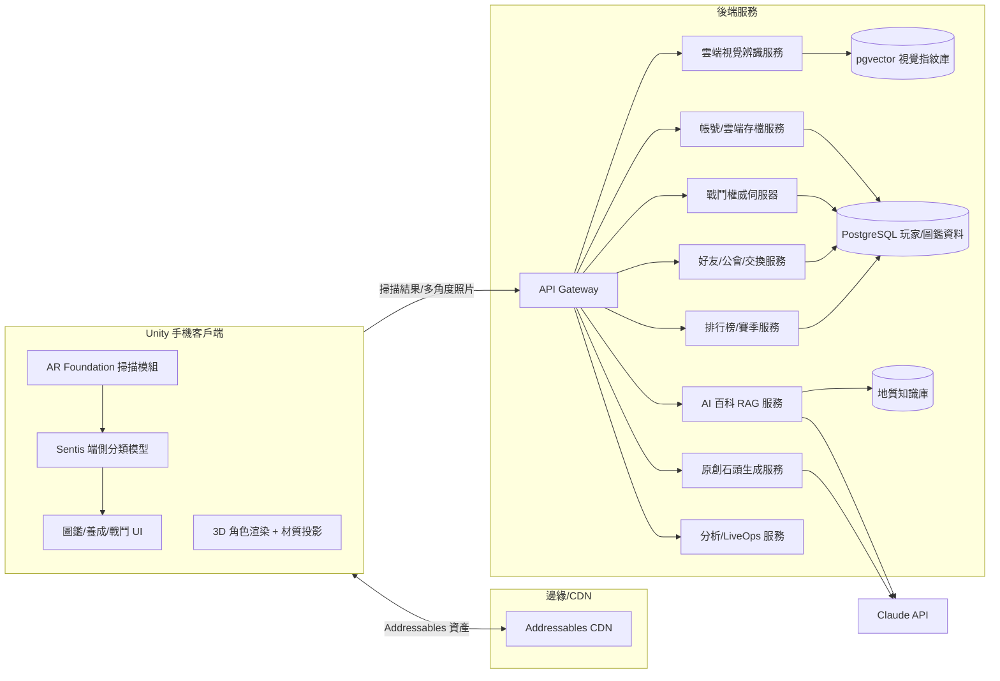
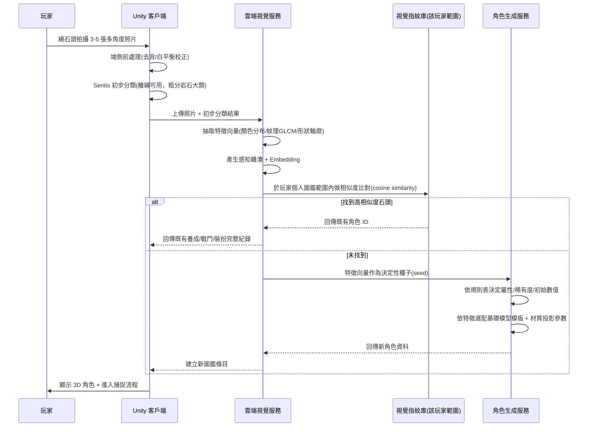

# 石頭大師 Stone Master — 技術架構文件

版本 v0.1 draft ｜ 對應 [GDD.md](./GDD.md)

---

## 1. 技術選型總覽

| 層 | 選型 | 理由 |
|---|---|---|
| 遊戲引擎 | **Unity 2022 LTS + URP** | AR/3D 手遊業界主流，跨 iOS/Android 單一程式碼庫，資產與人才生態成熟 |
| AR | **AR Foundation**（封裝 ARKit 6 / ARCore） | 同一套 API 對應雙平台，涵蓋平面偵測、光線估測、遮擋、影像追蹤 |
| 端側 AI 推論 | **Unity Sentis**（封裝 Core ML / NNAPI / TFLite） | 跨平台單一模型部署介面，用於離線可用的初步石頭分類 |
| 多人連線 | **Photon Fusion**（或 Unity Netcode + Relay） | 成熟的手遊 PvP/大廳/房間方案，減少自建 matchmaking 基礎設施成本 |
| 內容更新 | **Unity Addressables + CDN** | 新造型/活動資產可 OTA 更新，不受商店審核週期綁架 LiveOps 節奏 |
| 後端 API | 自建服務（Node.js/TypeScript 或 Go）+ PostgreSQL + Redis | 需要自訂戰鬥權威判定、視覺指紋比對等客製邏輯，BaaS 不足以覆蓋 |
| 雲端 AI 服務 | 自架推論服務（PyTorch → ONNX）+ 向量資料庫（pgvector） | 石頭視覺指紋比對、AI 百科 RAG 檢索 |
| LLM | Claude API | AI 百科問答生成、原創石頭故事文本、個人化助手敘事 |
| 物件/圖片儲存 | S3 相容物件儲存 + CDN | 玩家掃描照片、生成的材質貼圖 |

---

## 2. 系統架構圖



---

## 3. AR 掃描與角色生成 Pipeline



**關鍵設計原則**：同一顆真實石頭 → 同一組特徵向量（誤差內）→ 決定性種子 → **同一位玩家永遠得到同一隻角色**，但不同玩家掃描同一顆石頭會各自生成屬於自己帳號的獨立版本（比對範圍限定在玩家個人圖鑑，而非全域），避免「先搶先贏」的稀缺性問題，也大幅降低比對運算規模。

---

## 4. 3D 模型生成策略：參數化基礎模型 + 材質投影

**不採用**完整攝影測量（photogrammetry）——手機隨手 3～5 張照片難以重建高品質網格，且雲端運算成本與延遲不利於「掃描後立即看到角色」的核心體驗。

**採用**：
1. 美術團隊預先製作一組基礎石頭網格模板庫（圓潤河石、尖銳火成岩塊、水晶簇、球狀結核、片狀變質岩……約 20～30 種基礎形狀，依莫氏硬度/岩石分類各配數種）。
2. 從照片抽取：主色票（palette）、粗糙度/光澤估計、紋理圖樣（用於法線貼圖/細節貼圖生成）。
3. 依分類結果選擇最接近的基礎模板，再用抽出的材質參數做 shader 投影與細節疊加（色彩分層、裂紋/紋理 decal、光澤度）。
4. 五官與裝扮系統（GDD 第 8～9 章）疊加於同一套模板骨架，確保所有角色共用綁定點，裝扮資產可重複使用。

此方法讓每隻角色「看起來獨一無二」，同時維持效能可預期（多邊形數/材質數受控）、生成延遲可控在秒級。

---

## 5. AI 石頭百科：RAG 架構

```
玩家提問 → 向量化查詢 → pgvector 於地質知識庫檢索相關條目
        → 檢索結果 + 系統提示（僅可依據檢索內容回答，禁止捏造）
        → Claude API 生成口語化回答 → 附資料來源摘要回傳前端
```

知識庫由地質內容顧問建置與審核，版本化管理，避免 LLM 在硬度/成分/產地等事實性資料上產生幻覺——這是教育型內容的紅線，必須嚴格 grounding。

---

## 6. 位置資料與隱私

- 客戶端定位後，僅回傳**粗粒度地理格網**（如 S2 Cell Level 13～15，約數百公尺精度）供伺服器判斷生態/地質分佈，**不上傳精確座標軌跡**。
- 玩家歷史足跡不做可回溯的路徑儲存，僅保留「已探索格網」的布林狀態供圖鑑地圖顯示。
- 未成年帳號預設關閉「顯示我的位置給好友」「陌生人可加好友」。
- 資料保留與刪除權（GDPR/CCPA）需在帳號設定提供「刪除我的資料」入口。

---

## 7. 反作弊與伺服器權威設計

- **戰鬥結算**：所有傷害/技能判定於伺服器計算，客戶端僅負責表現層動畫，杜絕改包作弊。
- **捕捉結算**：成功率計算與晶球/誘餌庫存扣除於伺服器驗證。
- **移動合理性**：GPS 座標變化速度超過合理閾值（如判定為瞬移/模擬定位）時降權或阻擋內容供給，比照同類 AR 手遊的防作弊模式。
- **交換系統**：雙方需伺服器端雙簽確認，避免單邊詐欺或利用網路延遲重複交換。

---

## 8. 裝置分級與效能策略

| 分級 | 依據 | 策略 |
|---|---|---|
| Low | 記憶體 < 4GB 或 GPU 較舊 | 關閉即時陰影/後製特效，AI 辨識全走雲端，降低模型多邊形 LOD |
| Mid | 主流機種 | 標準 AR 特效，端側粗分類 + 雲端精細比對 |
| High | 旗艦機 | 完整光照/粒子特效，端側可執行較大模型，降低雲端延遲依賴 |

---

## 9. 核心資料模型（摘要）

| 資料表 | 關鍵欄位 |
|---|---|
| `player` | id, account, region, created_at |
| `stone_instance`（玩家擁有的個體） | id, owner_id, species_id, visual_fingerprint, level, exp, affinity, mood, custom_face_json, outfit_json, discovered_at, discovered_geocell |
| `stone_species`（圖鑑原型/物種定義） | id, name_zh, name_en, sci_name, rock_type, mineral_composition, hardness, density, luster, formation, era, locations, rarity_table_ref |
| `skill` | id, name, type(攻擊/防禦/輔助/終極), power, cost, unlock_condition |
| `battle_log` | id, player_a, player_b, result, replay_seed, season_id |
| `guild` / `guild_member` | 公會與成員關係 |
| `trade` | id, from_player, to_player, stone_instance_id, status, server_signature |
| `season_rank` | player_id, season_id, tier, score |

---

## 10. 開發環境需求

- Unity 2022 LTS，AR Foundation 5.x，URP。
- Xcode（iOS 建置）、Android SDK/NDK（Android 建置）。
- 實機測試機：至少各一台中階與高階 iOS/Android 裝置（AR 效能差異大，模擬器不可靠）。
- 後端本機開發：Docker Compose（PostgreSQL + Redis + pgvector 擴充）。
